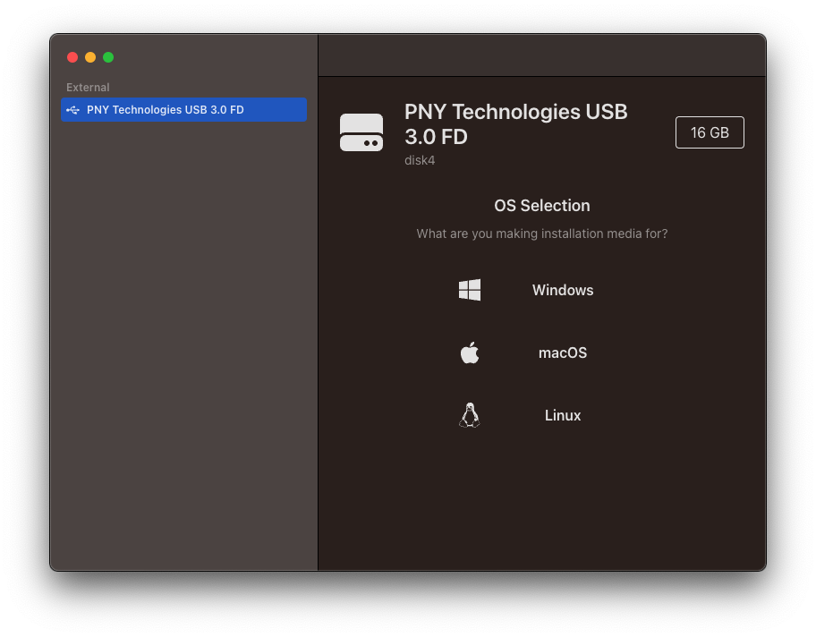

# windows-install-maker

An Electron app to easily create Windows install media on MacOS.



## Wants

* Ship with `wimlib` + it's deps
* Ability to download `.iso` files

## Quick Setup

```sh
# clone the project
git clone https://github.com/kyleaupton/windows-install-maker.git

# enter the project directory
cd windows-install-maker

# install dependencies
yarn

# develop
yarn dev
```

## Debug

(gif courtesy of the template repo!)


## Directory

```diff
+ ├─┬ electron
+ │ ├─┬ main
+ │ │ └── index.ts    entry of Electron-Main
+ │ └─┬ preload
+ │   └── index.ts    entry of Preload-Scripts
  ├─┬ src
  │ └── main.ts       entry of Electron-Renderer
  ├── index.html
  ├── package.json
  └── vite.config.ts
```
